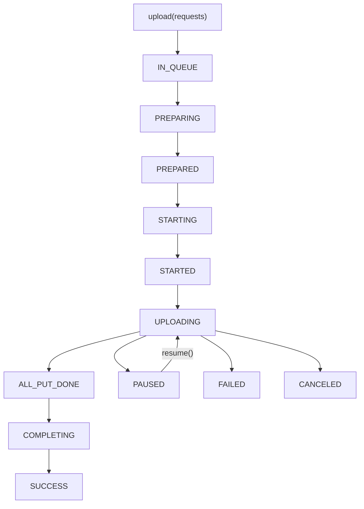

# Uploader

Kotlin Multiplatform library for chunked file uploads to cloud storage (Drive-style multipart APIs), with pause/resume, retry, and persistent upload state across app restarts.

[](https://central.sonatype.com/search?q=io.github.mohamadkaramidarabi)
[](LICENSE)

Repository: [github.com/mohamadkaramidarabi/uploader](https://github.com/mohamadkaramidarabi/uploader)

Licensed under the [Apache License 2.0](LICENSE) (free and open source).

---

## Table of contents

- [What this library does](#what-this-library-does)
- [Supported platforms](#supported-platforms)
- [Setup](#setup)
- [Quick start](#quick-start)
- [How it works](#how-it-works)
- [API reference](#api-reference)
- [Platform setup](#platform-setup)
- [Upload states](#upload-states)
- [Complete example](#complete-example)
- [Sample apps in this repo](#sample-apps-in-this-repo)
- [Publishing](#publishing)

---

## What this library does

- **Chunked uploads** — splits large files into parts using chunk size and signed URLs from your backend.
- **Upload queue** — enqueue multiple files; the engine processes them in the background.
- **Lifecycle control** — `pause`, `resume`, `cancel`, and `retry`.
- **Progress tracking** — observe upload state and per-chunk progress via Kotlin `Flow`.
- **Persistence** — survives process restarts:
  - **Android / JVM** — Room database.
  - **Web** — IndexedDB (metadata + file blobs for resume after page refresh).
- **Android notifications** — optional foreground notification while uploads are active.

You bring your own HTTP layer. The library calls your `startUpload`, `putChunk`, `completeUpload`, and `cancelUpload` callbacks — it does not hard-code a specific REST API.

---

## Supported platforms

| Target | File reading | Persistence |
|--------|--------------|-------------|
| Android | Content `Uri` or filesystem path | Room |
| JVM (Desktop) | Filesystem path | Room |
| iOS | Native file path | In-memory (via cache layer) |
| JS / Wasm (Web) | `web-file://` paths via `WebFileRegistry` | IndexedDB |

---

## Setup

### 1. Add the dependency

In your Kotlin Multiplatform module, add the main artifact to `commonMain`:

```kotlin
// build.gradle.kts
kotlin {
    sourceSets {
        commonMain.dependencies {
            implementation("io.github.mohamadkaramidarabi:uploader-api:0.1.8")
        }
    }
}
```

`uploader-api` pulls in `uploader-common` transitively. Room/IndexedDB implementations are bundled inside the platform-specific parts of `uploader-api` — you do not need to add `uploader-database` unless you extend the cache layer yourself.

### 2. Requirements

- Kotlin Multiplatform project
- Kotlin **2.x** recommended
- Coroutines
- Your own HTTP client for the four upload callbacks (the sample app uses Ktor)

### 3. Initialize once

Create a single `IUploader` instance at app startup (e.g. in DI or `Application.onCreate`). The library uses a singleton internally — call `IUploader.init(...)` only once.

---

## Quick start

```kotlin
import ir.sharif.drive.uploader.api.IUploader
import ir.sharif.drive.uploader.models.*
import ir.sharif.drive.uploader.models.CloudPath.Companion.cloudPath
import ir.sharif.drive.uploader.models.FileName.Companion.fileName
import ir.sharif.drive.uploader.models.FilePath.Companion.filePath
import ir.sharif.drive.uploader.models.FileSize.Companion.fileSize

// 1. Initialize (once)
val uploader = IUploader.init(
    startUpload = { size, metaData ->
        // Call your backend → return upload id, key, chunk size, signed URLs
        myApi.startUpload(size, metaData)
    },
    putChunk = { signedUrl, chunkData, contentLength ->
        // PUT chunk to signed URL → return ETag (without quotes)
        myApi.putChunk(signedUrl, chunkData, contentLength)
    },
    completeUpload = { request ->
        // Tell your backend all parts are uploaded
        myApi.completeUpload(request)
    },
    cancelUpload = { uploadInfo ->
        // Optional: notify backend to abort multipart upload
        myApi.cancelUpload(uploadInfo)
    },
    fileReaderContext = platformContext, // see Platform setup below
)

// 2. Enqueue files
uploader.upload(
    listOf(
        UploadRequest(
            fileName = "photo.jpg".fileName,
            filePath = "/path/or/uri".filePath,
            fileSize = 5_242_880L.fileSize,
            folderId = null,
            cloudPath = "/uploads".cloudPath,
            versionGroup = null,
            metaData = null,
        ),
    ),
)

// 3. Observe uploads
uploader.getAllUploadInfos().collect { uploads ->
    uploads.forEach { info ->
        println("${info.name.value}: ${info.state}")
    }
}
```

---

## How it works

The uploader runs a background engine that moves each file through these stages:



**Step by step:**

1. **`upload()`** — saves `UploadRequest` items to the local cache (`IN_QUEUE`).
2. **`startUpload` callback** — your backend returns `uploadId`, `key`, `chunkSize`, and a list of signed URLs (one per chunk).
3. **`putChunk` callback** — for each chunk, the library reads bytes from the local file and PUTs them to the signed URL. You return the `ETag` from the response.
4. **`completeUpload` callback** — after all chunks succeed, the library calls your backend with part numbers and ETags to finalize the multipart upload.
5. **Persistence** — upload and chunk state are saved locally so uploads can resume after restart (platform-dependent).

---

## API reference

### `IUploader.init(...)`

| Callback | When it runs | What you return / do |
|----------|--------------|----------------------|
| `startUpload(size, metaData)` | Before first chunk | `StartUploadResponse(uploadId, key, chunkSize, links)` |
| `putChunk(url, data, contentLength)` | For each chunk | `ETag` string from storage provider |
| `completeUpload(request)` | After all chunks uploaded | Finalize on your backend |
| `cancelUpload(uploadInfo)` | On `cancel()` | Abort remote upload (optional) |
| `fileReaderContext` | At init | Platform context for reading files (see below) |

### `StartUploadResponse`

```kotlin
data class StartUploadResponse(
    val uploadId: String,
    val key: String,
    val chunkSize: Long,
    val links: List<String>, // signed PUT URLs, one per chunk
)
```

### `UploadRequest`

```kotlin
data class UploadRequest(
    val fileName: FileName,   // display name
    val filePath: FilePath,   // platform-specific path (see Platform setup)
    val fileSize: FileSize,   // total bytes
    val folderId: FolderId?, // destination folder on cloud (optional)
    val cloudPath: CloudPath,  // logical cloud path
    val versionGroup: String?,
    val metaData: String?,     // passed to startUpload
)
```

Use the extension helpers to build typed values:

```kotlin
"file.pdf".fileName
"/storage/emulated/0/Download/file.pdf".filePath
contentUri.toString().filePath          // Android
"web-file://1".filePath                 // Web
1_048_576L.fileSize
"/drive/folder".cloudPath
```

### Main operations

| Method | Description |
|--------|-------------|
| `upload(requests)` | Enqueue one or more files |
| `getAllUploadInfos()` | `Flow<List<UploadInfo>>` — all uploads and states |
| `getUploadingByState(state)` | Filter uploads by state |
| `pause(id)` | Pause an active upload |
| `resume(id)` | Resume a paused upload |
| `cancel(id)` | Cancel upload and call `cancelUpload` |
| `retry(id)` | Clear chunks and re-queue from scratch |
| `deleteAll()` | Remove all uploads from cache |

### Observing progress

```kotlin
uploader.getAllUploadInfos().collect { uploads ->
    uploads.forEach { info ->
        val total = info.chunkCount?.value ?: return@forEach
        val done = info.links.count { it.state == States.Link.State.SUCCESS }
        println("${info.name.value}: $done / $total chunks")
    }
}
```

---

## Platform setup

### Android

**File reader context** — pass `Application` or `Activity` context:

```kotlin
IUploader.init(
    // ...
    fileReaderContext = applicationContext,
)
```

**File paths** — use content `Uri` strings (recommended) or absolute filesystem paths:

```kotlin
UploadRequest(
    filePath = contentUri.toString().filePath,
    // ...
)
```

Grant persistable read permission when picking files (see `composeApp` `FilePicker.android.kt`).

**Notifications** (optional) — enabled by default on Android. Wire permission request in your `Activity`:

```kotlin
import ir.sharif.drive.uploader.api.ensureUploadNotificationsEnabled
import ir.sharif.drive.uploader.upload.UploadNotificationPermissionHost
import ir.sharif.drive.uploader.upload.UploadNotificationPermissions

// In Activity.onCreate:
UploadNotificationPermissionHost.activity = this
UploadNotificationPermissionHost.launcher = permissionLauncher
UploadNotificationPermissions.requestIfNeeded(this, permissionLauncher)

// Before starting uploads:
ensureUploadNotificationsEnabled()
```

### JVM (Desktop)

**File reader context** — pass any value (`Any()`); paths are read directly from disk:

```kotlin
fileReaderContext = Any()

UploadRequest(
    filePath = "/Users/me/Documents/file.zip".filePath,
    // ...
)
```

### Web (JS / Wasm)

Browsers do not expose real filesystem paths. Register picked `File` objects and use the returned path:

```kotlin
import ir.sharif.drive.uploader.source.file.WebFileRegistry

val path = WebFileRegistry.register(browserFile) // returns "web-file://1"

UploadRequest(
    filePath = path.filePath,
    fileName = browserFile.name.fileName,
    fileSize = browserFile.browserSize().fileSize,
    // ...
)
```

`WebFileRegistry` persists blobs in IndexedDB so uploads can resume after a page refresh.

**File reader context** — pass `Any()`:

```kotlin
fileReaderContext = Any()
```

### iOS

Pass a native filesystem path and `Any()` as context:

```kotlin
fileReaderContext = Any()

UploadRequest(
    filePath = nativePath.filePath,
    // ...
)
```

---

## Upload states

### Upload (`UploadInfo.State`)

| State | Meaning |
|-------|---------|
| `IN_QUEUE` | Waiting to start |
| `PREPARING` / `PREPARED` | Internal preparation |
| `STARTING` / `STARTED` | Calling `startUpload` on backend |
| `UPLOADING` | Chunks being uploaded |
| `PAUSED` | Paused by user |
| `ALL_PUT_DONE` | All chunks uploaded |
| `COMPLETING` | Calling `completeUpload` |
| `SUCCESS` | Finished |
| `FAILED` | Error (chunk or network) |
| `CANCELED` | Canceled by user |

### Chunk (`Link.State`)

| State | Meaning |
|-------|---------|
| `IN_QUEUE` | Waiting to upload |
| `RUNNING` | Upload in progress |
| `SUCCESS` | Chunk uploaded (ETag saved) |
| `FAILED` | Chunk failed |
| `PAUSED` | Paused with upload |

---

## Complete example

This mirrors the sample app in [`composeApp`](./composeApp). Map your HTTP DTOs to the library models:

```kotlin
val uploader = IUploader.init(
    startUpload = { size, metaData ->
        val response = uploadApi.startUpload(size)
        StartUploadResponse(
            uploadId = response.uploadId,
            key = response.key,
            chunkSize = response.chunkSize,
            links = response.signedUrls,
        )
    },
    putChunk = { url, chunkData, contentLength ->
        uploadApi.putChunk(url, chunkData, contentLength) ?: ""
    },
    completeUpload = { request ->
        // request is ir.sharif.drive.uploader.models.CompleteUploadRequest
        // Map fields to your backend API as needed
        uploadApi.completeUpload(request)
    },
    cancelUpload = { /* optional remote cancel */ },
    fileReaderContext = applicationContext,
)

// Enqueue
uploader.upload(
    listOf(
        UploadRequest(
            fileName = "report.pdf".fileName,
            filePath = uri.toString().filePath,
            fileSize = fileSize.fileSize,
            folderId = null,
            cloudPath = "/".cloudPath,
            versionGroup = null,
            metaData = null,
        ),
    ),
)

// Control
lifecycleScope.launch { uploader.pause(uploadId) }
lifecycleScope.launch { uploader.resume(uploadId) }
lifecycleScope.launch { uploader.cancel(uploadId) }
lifecycleScope.launch { uploader.retry(uploadId) }
```

---

## Sample apps in this repo

This repository includes full demo apps. Use them as reference implementations:

| Module | Role |
|--------|------|
| [`api`](./api), [`common`](./common), [`cache`](./cache) | **Published** libraries |
| [`composeApp`](./composeApp/src) | Shared demo UI + Koin DI + network layer |
| [`androidApp`](./androidApp) | Android entry point |
| [`desktopApp`](./desktopApp) | Desktop (JVM) entry point |
| [`webApp`](./webApp) | Web (JS + Wasm) entry point |
| [`iosApp`](./iosApp/iosApp) | iOS entry point |

Key reference files:

- DI / init: [`composeApp/.../di/AppModule.kt`](./composeApp/src/commonMain/kotlin/ir/sharif/drive/uploader/di/AppModule.kt)
- Upload UI: [`composeApp/.../main/MainViewModel.kt`](./composeApp/src/commonMain/kotlin/ir/sharif/drive/uploader/main/MainViewModel.kt)
- HTTP layer: [`composeApp/.../network/UploadApiImpl.kt`](./composeApp/src/commonMain/kotlin/ir/sharif/drive/uploader/network/UploadApiImpl.kt)
- Web file picker: [`composeApp/.../main/FilePicker.web.kt`](./composeApp/src/webMain/kotlin/ir/sharif/drive/uploader/main/FilePicker.web.kt)

### Build and run sample apps

**Android**

```shell
./gradlew :androidApp:assembleDebug          # macOS/Linux
.\gradlew.bat :androidApp:assembleDebug      # Windows
```

**Desktop (JVM)**

```shell
./gradlew :desktopApp:run
```

**Web (Wasm — recommended)**

```shell
./gradlew :webApp:wasmJsBrowserDevelopmentRun
```

**Web (JS — older browsers)**

```shell
./gradlew :webApp:jsBrowserDevelopmentRun
```

**iOS** — open [`iosApp`](./iosApp) in Xcode or use the IDE run configuration.

---

## Publishing

### Published artifacts

| Artifact | Module |
|----------|--------|
| `uploader-api` | `:api` |
| `uploader-common` | `:common` |
| `uploader-cache-api` | `:cache:cache-api` |
| `uploader-database` | `:cache:database` |

### Local publish (maintainers)

```shell
./gradlew publishAllModules
```

Requires Sonatype and GPG credentials in `~/.gradle/gradle.properties` or as `ORG_GRADLE_PROJECT_*` environment variables.

Override version:

```shell
./gradlew publishAllModules -Pversion=0.1.9
```

### CI publish (GitHub Actions)

Push a version tag to trigger publishing:

```bash
git tag v0.1.9
git push origin v0.1.9
```

Workflow: [`.github/workflows/publish.yml`](./.github/workflows/publish.yml)

Required GitHub secrets: `MAVEN_CENTRAL_USERNAME`, `MAVEN_CENTRAL_PASSWORD`, `SIGNING_KEY`, `SIGNING_KEY_ID`, `SIGNING_KEY_PASSWORD`.

---

## Learn more

- [Kotlin Multiplatform](https://www.jetbrains.com/help/kotlin-multiplatform-dev/get-started.html)
- [Compose Multiplatform](https://github.com/JetBrains/compose-multiplatform)
- [Kotlin/Wasm](https://kotl.in/wasm/)
